# CGRA 2020/2021

## Group T07xG05

Maria Beatriz Russo Lopes dos Santos up201906888

## Project Notes
Uma vez que não é referido no enunciado a tecla que se utiliza para realizar o lançamento de pedras, optei por utilizar a tecla 't'.
Por me encontrar sem par no projeto levou algum tempo e maior dedicação mas penso que consegui objeter um bom resultado

## Screenshots

### 1 - MyFish

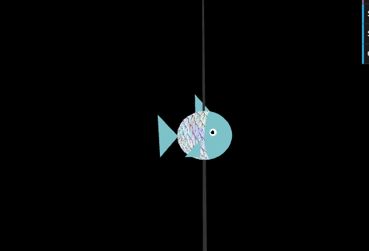

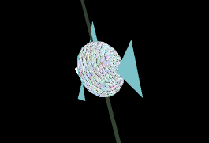

### 2 - Sea Floor

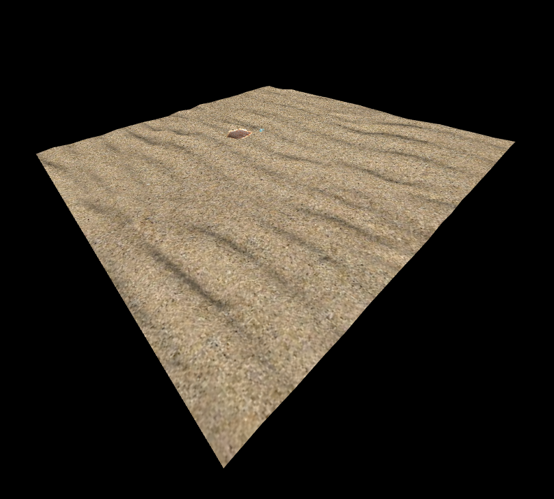

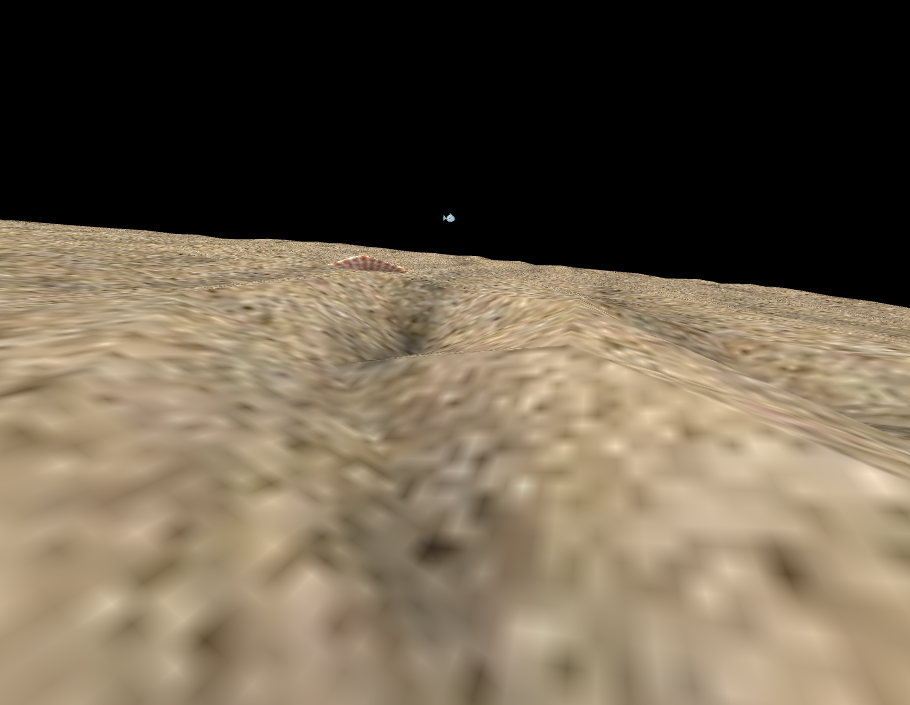

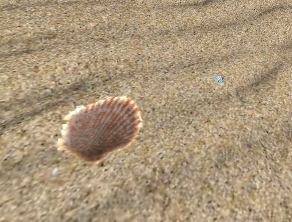

### 3 - Water Surface

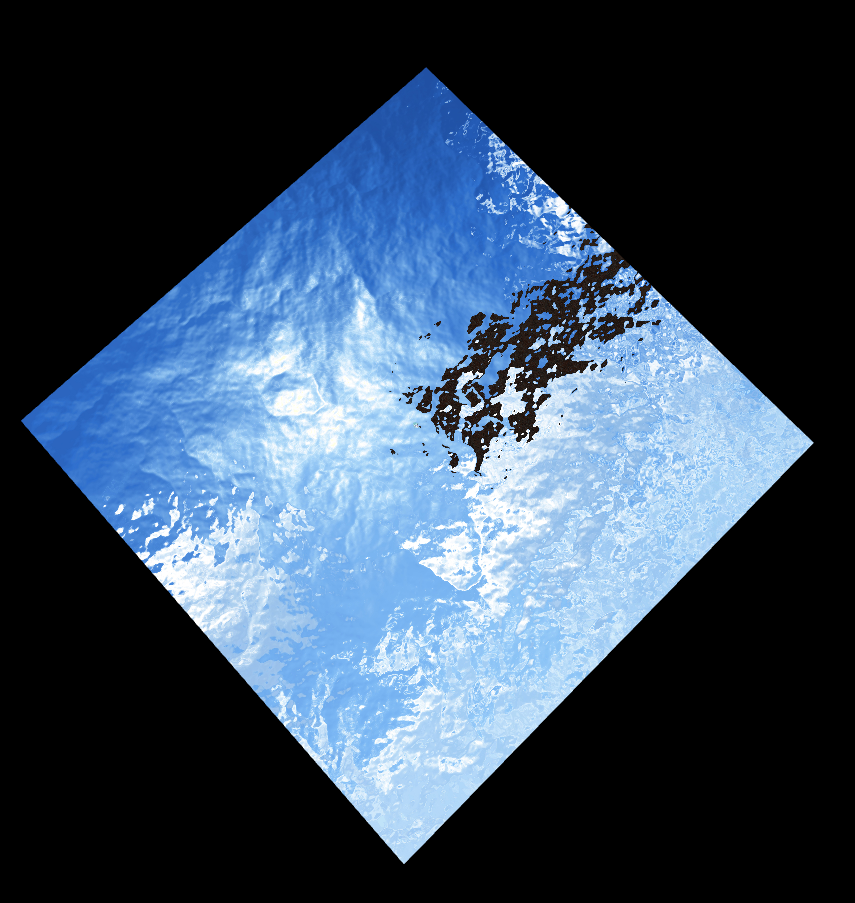

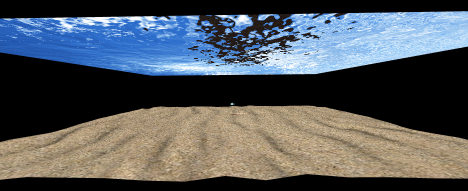

### 4 - Rock Set

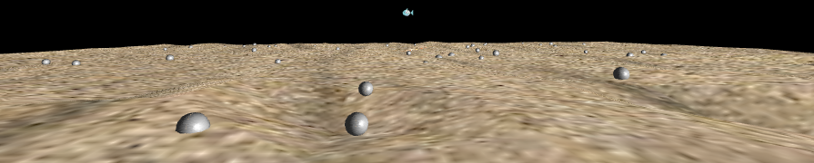

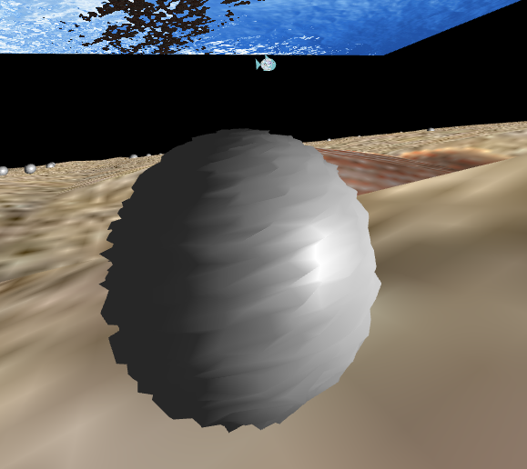

### 5 - Pillar

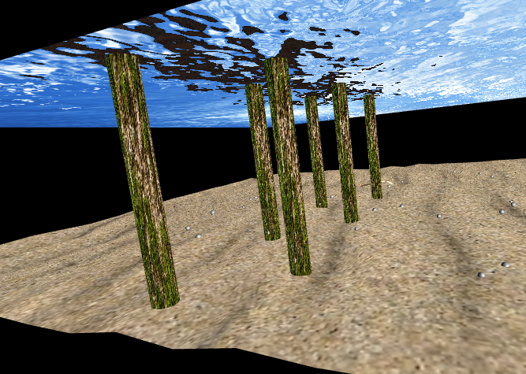

### 6 - Other elements

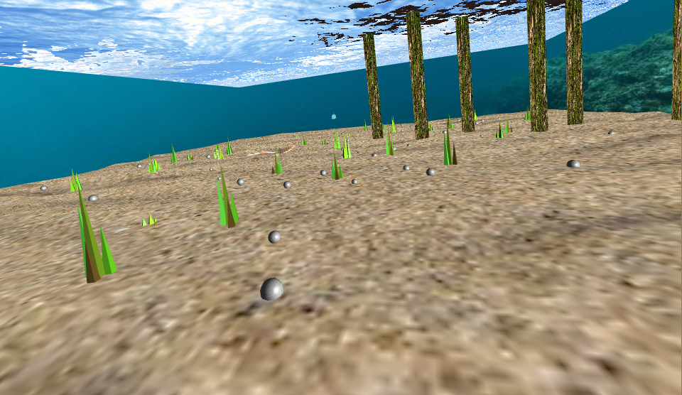

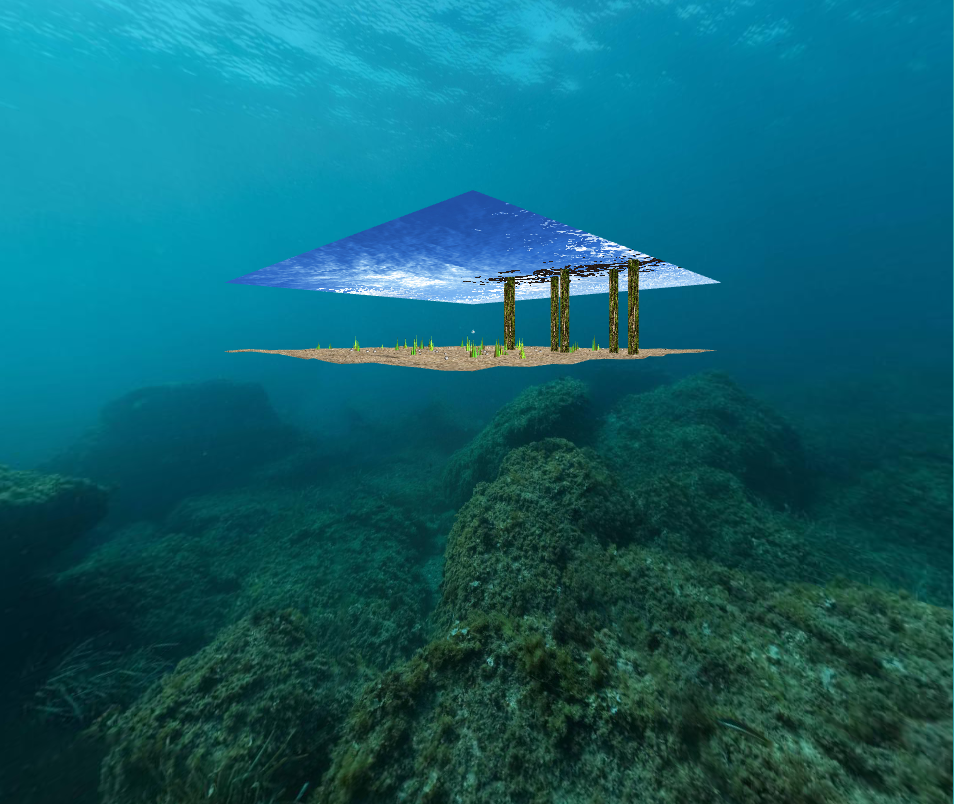

### 7 - Rocks on the nest

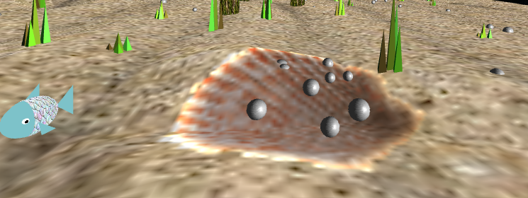

### 8 - Aditional Functionalities

Throwing the rock
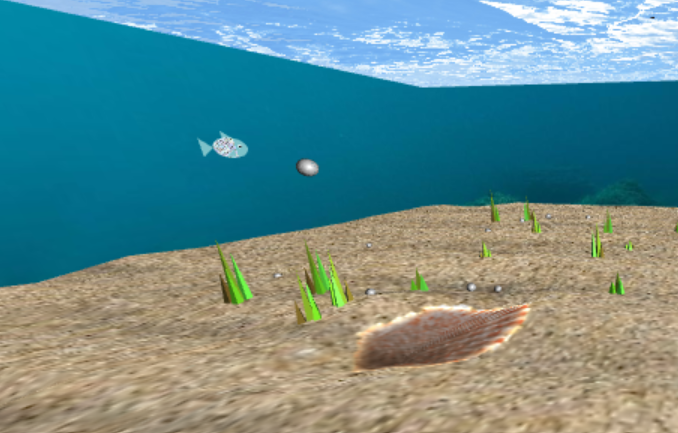

Animated fishes
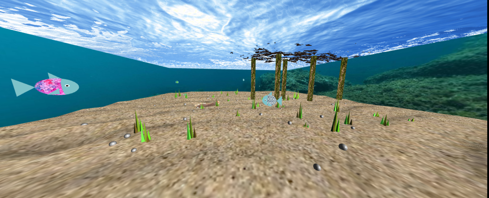